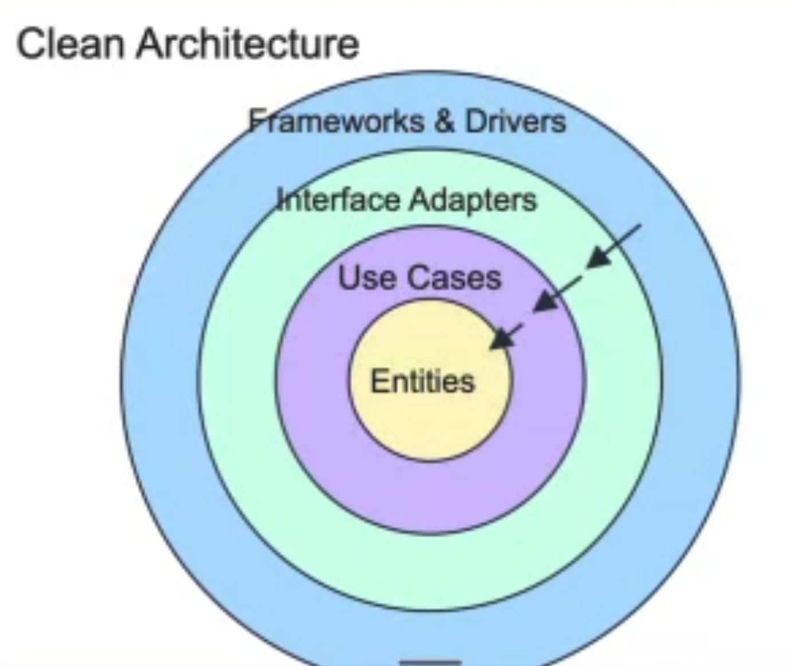

# 2주차 기록
## user-point 구조를 어떻게 처리해야 할까

## 1. 상황·예시
지금의 point는 단순 추가만 있기 때문에, 따로 테이블로 빼는 것에 대한 고민을 하였습니다.
```
1. user와 point 테이블을 분리
2. point테이블은 단순히, id, userId, point_balance만 있는 것을 확인
3. user테이블에 컬럼으로 추가
```
의 과정을 거쳤습니다.

1주차, 2주차 멘토링 동안 제 질문에 대한 공통된 멘토님들의 답변은 YAGNI였습니다.
point의 기능이 추가될 것 같지만, 당장은 추가되지 않았고, 요구사항에도 없었기 때문에 user테이블의 컬럼으로 추가하였습니다.

멘토링 과정에서, 이 내용에 대한 질문을 드렸고, 멘토님께서는 user테이블의 성격과 point 컬럼의 불일치에 대해 말씀주셨습니다.
그래서 단순히 너무 기능적으로만 테이블을 생각했던 것 같아서, 테이블의 성격을 잊고 있었다는 생각이 들었고, 다시 한번 고민을 시작했습니다.

하지만, 처음에 생각한 것이 이미 머릿속에 들어왔는지, 지금 요구사항으로는 point도 user의 속성이 될 수도 있지 않을까... 라는 생각이 계속 남아있게 되었고,
'간단하게 만드는 것'과 선택과 집중을 하기로 하였고, 설계에는 정답이 없다. 틀리면 오히려 좋아. 의 마인드로 진행했습니다.

그래서 제 최종 결론은 point는 user에 남아있다... 입니다.

다음 과제를 진행하게 되면서 이 선택이 어떤 파장을 불러일으킬지는 모르겠지만, 당장의 요구사항으로 봤을 때는 이 방법도 그렇게 틀리지 않았다 라고 생각하면서 작업을 하게 된 것 같습니다.

다만...User 도메인을 만드니, 실제 user의 동작보다 point의 동작이 더 많은걸 보고, 이래서..멘토님이 이렇게 말씀주신걸까 싶었습니다.

```kotlin
class User private constructor(
    val name: String,
    state: EntityState,
    balance: Long,
) {
    constructor(name: String) : this(name, EntityState(), 0)

    val id: Long = state.id
    val createdAt: ZonedDateTime = state.createdAt
    val updatedAt: ZonedDateTime = state.updatedAt

    var pointBalance: PointBalance = PointBalance(balance)
        private set

    fun chargePoint(amount: Long) {
        pointBalance = pointBalance.charge(amount)
    }

    fun payPoint(amount: Long) {
        pointBalance = pointBalance.pay(amount)
    }

    fun assertCanPay(amount: Long) {
        pointBalance.pay(amount)
    }

    companion object {
        fun reconstitute(name: String, balance: Long, state: EntityState): User = User(name, state, balance)
    }
}
```

그래서 다시 AI와 논의 후...설계를 변경했습니다.

Point를 독립된 애그리거트로 분리하고, VO가 아닌 도메인으로 분리하기 위해, 결국 point용 테이블을 추가하였습니다.
다시 한번 테이블을 설계할 때는 테이블의 성격이 중요하다...는걸 다시 깨달았습니다.

``` kotlin
class User private constructor(
    val name: String,
    state: EntityState,
) {
    constructor(name: String) : this(name, EntityState())

    val id: Long = state.id
    val createdAt: ZonedDateTime = state.createdAt
    val updatedAt: ZonedDateTime = state.updatedAt

    companion object {
        fun reconstitute(name: String, state: EntityState): User = User(name, state)
    }
}

class PointAccount private constructor(
    val userId: Long,
    balance: Long,
) {
    var balance: PointBalance = PointBalance(balance)
        private set

    init {
        if (userId <= 0) throw CommerceException(CommerceFailure.INVALID_REQUEST)
    }

    fun charge(amount: Long) {
        balance = balance.charge(amount)
    }

    fun pay(amount: Long) {
        balance = balance.pay(amount)
    }

    fun assertCanPay(amount: Long) {
        balance.pay(amount)
    }

    companion object {
        fun open(userId: Long): PointAccount = PointAccount(userId, 0)

        fun reconstitute(userId: Long, balance: Long): PointAccount = PointAccount(userId, balance)
    }
}
```

## 2. 판단·이유

- point_balance가 user에 속할 때,
### ADR-011: 현재 포인트 잔액은 users 테이블에 저장

| 대안 | 비용 (단점·트레이드오프) | 선택 |
| --- | --- | --- |
| A. `PointBalance`를 Value Object로 두고 `users.point_balance`에 저장 | 포인트 정책이 독립적으로 성장하면 User 모델과 저장 구조를 다시 분리해야 함 | ✅ |
| B. 사용자별 `point_balances` 테이블과 별도 Aggregate Root를 둠 | 사용자당 잔액 하나를 위해 별도 행을 두고, User와의 1:1 무결성을 따로 관리해야 함 |  |

A를 선택한 이유는 다음과 같습니다.

- 사용자당 **현재 잔액 하나**만 있고, 유효기간·적립 건·거래 이력이 없습니다.
- 잔액은 User와 **생명주기가 같습니다.**
- 별도 행과 1:1 무결성을 관리하지 않아도 되고, User가 자신의 잔액 행동(충전·사용)을 직접 책임집니다.

다만 포인트 원장, 포인트 종류, 유효기간, 또는 User와 독립적인 잔액 생명주기가 필요해지면 B로 분리하는 것을 다시 검토하려고 합니다.


- point를 따로 테이블로 뺏을 때
### ADR-011: 포인트 잔액을 독립 PointAccount에 저장

| 대안 | 비용 (단점·트레이드오프) | 선택 |
| --- | --- | --- |
| A. `PointBalance` VO를 User가 소유하고 `users.point_balance`에 저장 (이전 선택) | 충전·사용 행동이 User에 쌓여, User가 자기 정보보다 포인트 책임을 더 많이 떠안음 |  |
| B. `PointAccount`를 별도 Aggregate Root로 두고 `PointBalance` VO를 그 안에 유지, `point_balances.balance`에 저장 | 별도 저장소가 필요하고, 계정 행이 없는 경우를 따로 처리해야 하며, 기존 `users.point_balance` 데이터를 옮겨야 함 | ✅ |

이전에 A를 고른 이유는 사용자당 잔액이 하나이고, 유효기간·거래 이력이 없어 단순하다는 것이었습니다.
B로 바꾼 이유는 다음과 같습니다.

- 유상 포인트의 충전·사용과 잔액 불변식은 사용자 표시명과 **독립적인 책임**입니다.
- User와 생명주기가 같더라도, 반드시 **같은 Aggregate일 필요는 없습니다.**
- 실제로 User에 잔액을 두었을 때, User의 행동 대부분이 포인트 행동이었습니다.

다만 User 생성 API가 생기면, User를 만들 때 계정도 함께 여는 방식으로 초기화를 옮기는 것을 다시 검토하려고 합니다.

---

## 개인 숙제
### clean architecture


기본 개념인 '코드를 계층 구조로 구성하고, 각 계층은 특정 목적(SRP)을 갖도록 하는 것'  
의존성이 안쪽으로 이동하며, 바깥쪽 레이어는 바로 아래 레이어의 의존하지만, 안쪽 레이어는 바깥쪽 레이어에 의존하지 않음

#### 의존성 역전인 DIP는 클린 아키텍처의 핵심

- entities: 필수적인 비즈니스 규칙들의 집합
- usecase: 특정 어플리케이션에 대한 비즈니스 규칙
- interface adapter: 도메인과 인프라 사이의 변환기 역할
- infrastructure: UI, DB, framworks, device 등 I/O 구성 요소 (변동성이 가장 큰 계층)

SOLID원칙을 지켜져야, 클린 아키텍처 구성이 가능
- Single Responsibility Principle(SRP): 단일 책임 원칙 - 하나의 클래스는 변경되어야 하는 이유가 1개만 존재해야 한다.
- Open/Closed Principle(OCP): 개방-폐쇄 원칙 - 클래스나 컴포넌트에 기능을 추가할 순 있지만, 기존 기능을 수정할 필요는 없어야 한다.
- Liskov Substitution Principle(LSP): 리스코프 치환 원칙 - 하위 레벨의 클래스가 상위 레벨의 클래스의 동작에 영향을 주지 않고 대체 가능해야 한다.  
예)Java의 ArrayList와 LinkedList는 모두 List 인터페이스를 구현하므로 서로 대체 가능
- Interface Segregation Principle(ISP): 인터페이스 분리 원칙 - 클래스의 인터페이스를 사용하는 다른 클래스와 분리한다.
- Dependency Inversion Principle(DIP): 의존성 역전 원칙 - 변동성이 작은 클래스는 변동성이 큰 클래스에 의존하면 안된다.  

멘토링 시간에 배웠던 DIP의 예시는  
service -> repository <- JpaRepository/RedisRepository
에 대해서만 적용됐지만,  
클린 아키텍처에서는  
### '모든 레이어의 코드 의존성은 안쪽을 향하며, 필요한 경계에서 DIP를 활용해 의존성의 방향을 지킨다.'  
로 이해하면 될 것 같습니다.

클린 아키텍처를 배우기 위해선 DIP가 가장 기본이였으며, 이번 멘토링 시간에 멘토님이 시간을 할애해주시면서, DIP에 대해 너무 쉽게 설명을 해주셔서, 이해가 더 쉬웠던 것 같습니다.

## 짧은 회고 (선택)
DIP를 코드에 대입해야 하는데, 설계에 대입해 버린 상황이였던 것 같습니다.
기능 및 구현의 편의성을 위해 설계를 바꿔버린 생각을 해버린 점이 이번 과제에서 가장 큰 실수였던 것 같습니다.

말로 설명을 하지 못하는 지식, 애매하게 아는 지식을 말로 설명할 수 있을 때 까지 공부하고 이해하는 것이 중요하다...는 것을 다시 한번 깨달았습니다.

## 이번 주 목표

- [X] 설계를 해보자
- [X] DIP에 대해 공부해보자
- [X] layered architecture, clean architecture에 대해 공부해보자

## 아쉬운 점
- 기능 구현에 치우쳐 가장 중요한 테이블의 성격을 잊고 작업을 한 것 같다.
  - point는 user와 기능 상으로 연결된거지, user의 속하는 데이터가 아님에도 불구하고, 기능 및 구현의 편의성을 위해 user테이블에 컬럼으로 추가한 것이 화근...

## 참고 자료
- https://pusher.com/tutorials/clean-architecture-introduction/#use-cases